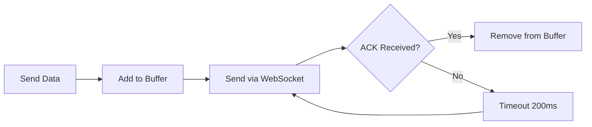
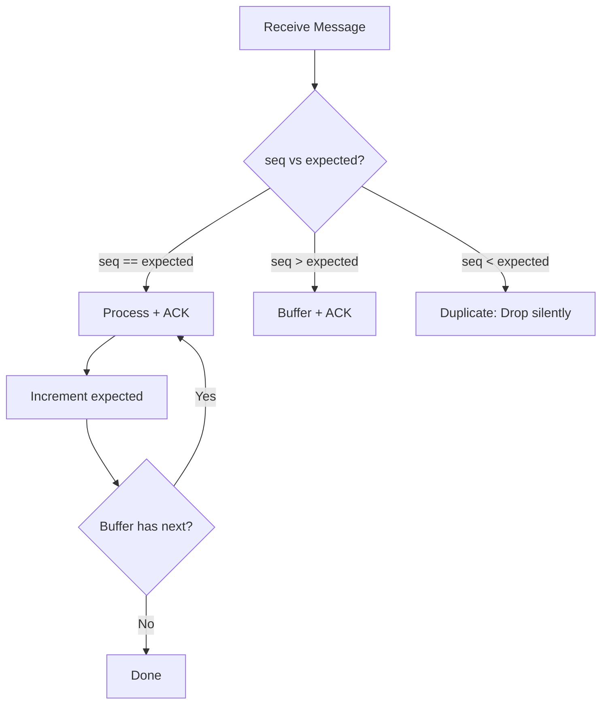
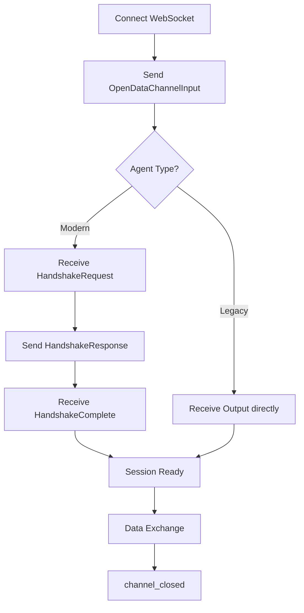
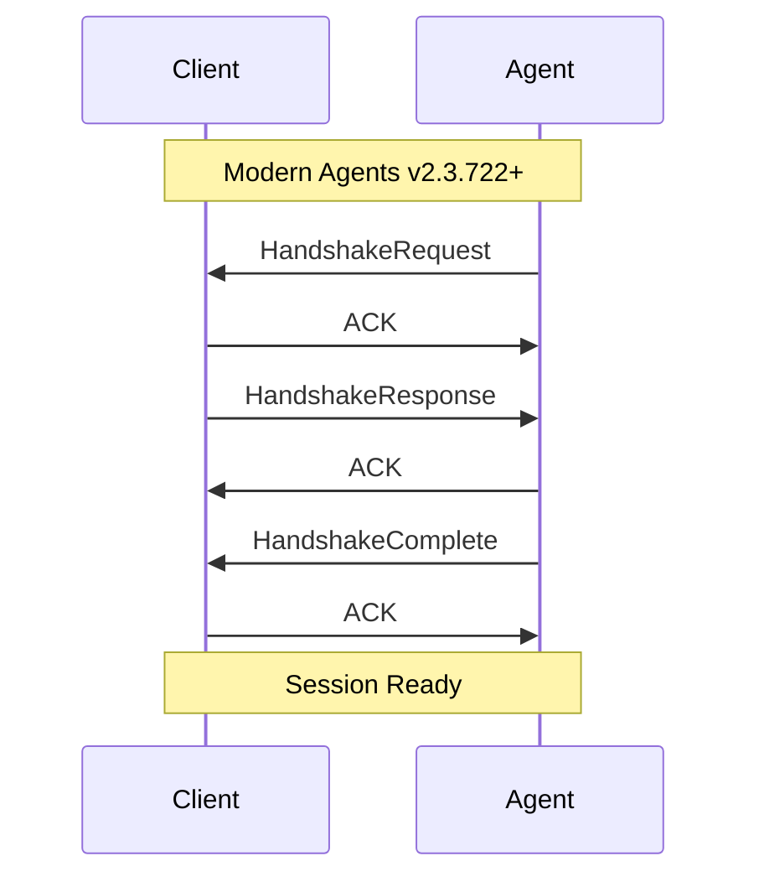
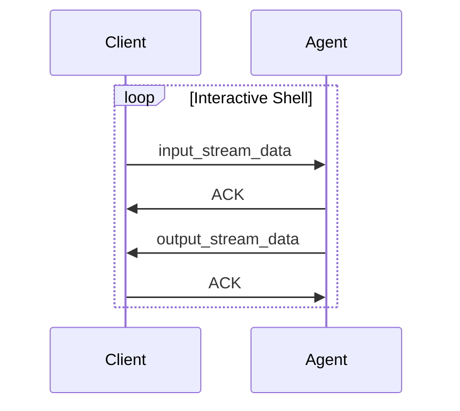
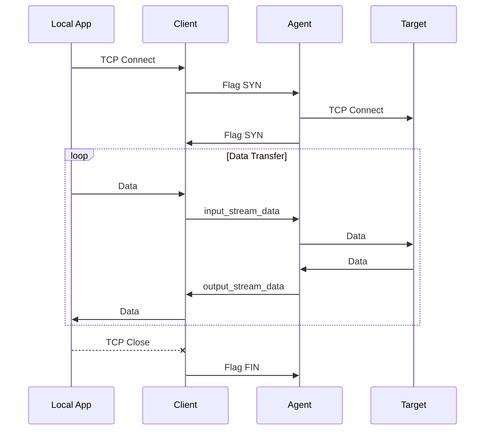

# Protocol Flow
{: .no_toc }

Sequence diagrams for AWS SSM Session Manager.
{: .fs-6 .fw-300 }

## Table of contents
{: .no_toc .text-delta }

1. TOC
{:toc}

---

## Overview

This document describes the protocol flow for AWS SSM Session Manager WebSocket communication, based on analysis of the [AWS session-manager-plugin](https://github.com/aws/session-manager-plugin).

## Message Buffers

Reliable message delivery uses two buffers:

| Buffer | Type | Capacity | Purpose |
|:-------|:-----|:---------|:--------|
| **OutgoingMessageBuffer** | LinkedList | 10,000 | Messages waiting for ACK |
| **IncomingMessageBuffer** | BTreeMap | 10,000 | Out-of-order messages |

**RTT Tracking** (Jacobson/Karels algorithm, RFC 6298):
- `RoundTripTime` - Smoothed RTT estimate
- `RoundTripTimeVariation` - RTT variance
- `RetransmissionTimeout` - Adaptive timeout

---

## Reliable Delivery

### Outgoing Flow



### Incoming Flow



{: .warning }
> **Critical**: Do NOT ACK duplicates. The sender tracks unacked messages and will stop retrying when duplicates aren't acknowledged.

---

## Session Lifecycle



---

## Handshake Sequence



---

## Data Exchange



---

## Binary Header Format

| Offset | Size | Field | Description |
|:-------|:-----|:------|:------------|
| 0 | 4 | HeaderLength | Always 116 |
| 4 | 32 | MessageType | e.g. "input_stream_data" |
| 36 | 4 | SchemaVersion | Always 1 |
| 40 | 8 | CreatedDate | Unix millis |
| 48 | 8 | SequenceNumber | Message sequence |
| 56 | 8 | Flags | SYN=1, FIN=2 |
| 64 | 16 | MessageId | UUID (byte-swapped) |
| 80 | 32 | PayloadDigest | SHA-256 of payload |
| 112 | 4 | PayloadType | 1=Output, 5=Handshake, etc. |
| 116 | 4 | PayloadLength | Payload size |

---

## Payload Types

| Type | Name | Direction | Description |
|:-----|:-----|:----------|:------------|
| 1 | Output | Agent→Client | Shell stdout |
| 2 | Error | Agent→Client | Error message |
| 3 | Size | Client→Agent | Terminal resize |
| 5 | HandshakeRequest | Agent→Client | Handshake initiation |
| 6 | HandshakeResponse | Client→Agent | Handshake reply |
| 7 | HandshakeComplete | Agent→Client | Handshake done |
| 10 | Flag | Both | Control flags |
| 11 | StdErr | Agent→Client | Shell stderr |
| 12 | ExitCode | Agent→Client | Process exit |

---

## ACK Format

ACK messages have specific fixed values:

| Field | Value |
|:------|:------|
| SequenceNumber | 0 (always) |
| Flags | 3 (SYN \| FIN) |
| MessageType | "acknowledge" |

**Payload** (JSON):
```json
{
  "AcknowledgedMessageType": "output_stream_data",
  "AcknowledgedMessageId": "uuid-string",
  "AcknowledgedMessageSequenceNumber": 42,
  "IsSequentialMessage": true
}
```

---

## UUID Wire Format

AWS uses non-standard byte order:

```
Standard:  [MSB 0-7] [LSB 8-15]
AWS Wire:  [LSB 8-15] [MSB 0-7]
```

---

## Port Forwarding



---

## Protocol Constants

| Constant | Value |
|:---------|:------|
| Header Length | 116 bytes |
| Schema Version | 1 |
| Max Payload | 64 KB |
| ACK Timeout | ~200ms |
| Max Retries | 3000 (5 min) |
| Buffer Capacity | 10,000 messages |

---

## Implementation Notes

1. **ACK Only Non-Duplicates**: `seq < expected` → drop silently
2. **ACK Immediately**: Don't wait for processing
3. **UUID Byte Swap**: LSB first (8-15), MSB second (0-7)
4. **PayloadDigest**: SHA-256 of payload only
5. **OpenDataChannelInput**: Send as TEXT, not binary
6. **Respect pause_publication**: Stop sending immediately
